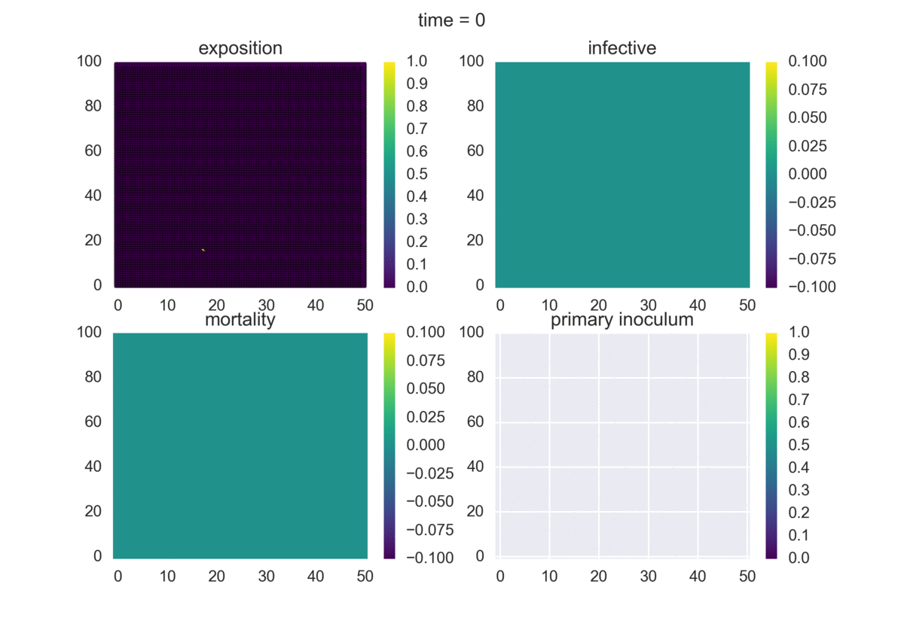
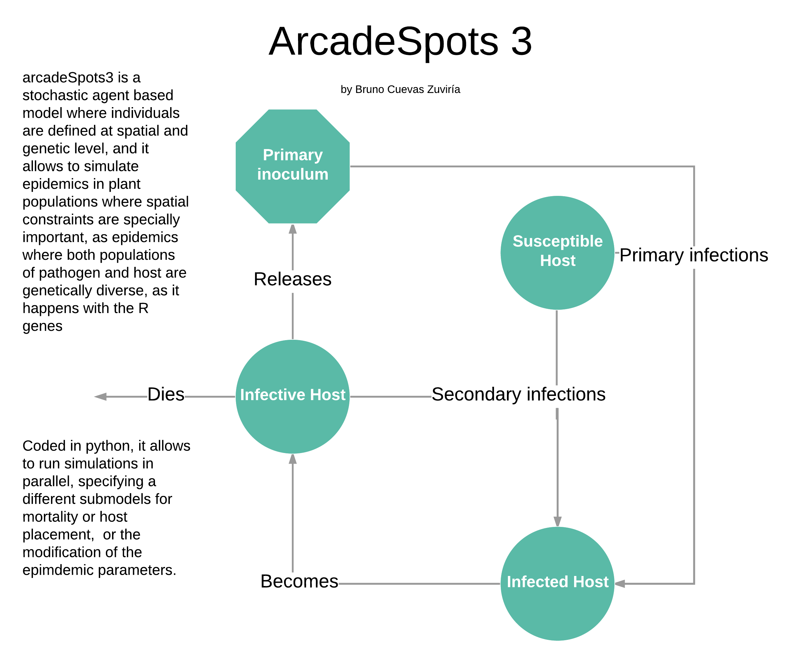
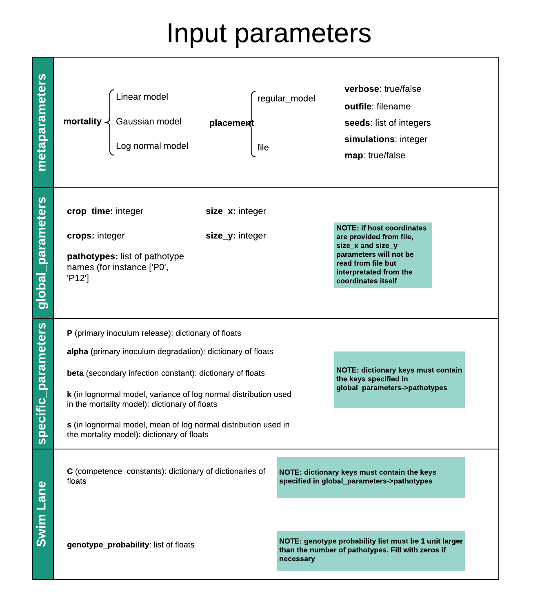

# arcadeSpots 3

Providing epidemiological models for plant-virus pathosystems

## Summary

Plant pathogens are important due to their socioeconomical impact.
Since experimentation with pathogens at environmental level is
technically difficult and expensive, epidemiologial 
models are a reasonable approach that allow to study the main
features of the pathogen-host system.

arcadeSpots3 allows to perform agent based simulations where
host and pathogen populations are genetically diverse, and so 
it describes the effects of diversity in an epidemic.

## Requirements

arcadeSpots3 is implemented in python3 and it requires
some standard libraries that can be found in the anaconda
distribution, as Numpy, Scipy, Matplotlib or Seaborn.

To run the parallel implementation of the program, both
mpi4py python library and mpi library are needed. Consult
your system administrator.

## Usage

arcadeSpots3 requires specific parameters for each simulation,
that must be stored in the form of a JSON dictionary. It is
possible to obtain a sample of the parameters file using

    import arcadeSimulator
    import json
    f = open('sample_parameters.json', 'w')
    f.write(json.dumps(arcadeSimulator.parametersDict,
        indent = 4, sort_keys = True))
    f.close()
 

Once parameters are specified, it is possible to
run simulations using just

    python arcadeSpots3.py sample_parameters.json
    
If more than one processor is available (for instance,
let's consider three processors), then a parallel
version of the program can be executed, using

    mpirun -np 3 arcadeMPI.py sample_parameters.json
    
Both programs produce an output that can be analyzed in R,
Python or Excel.

## FAQ

brunocuevaszuviria@gmail.com
